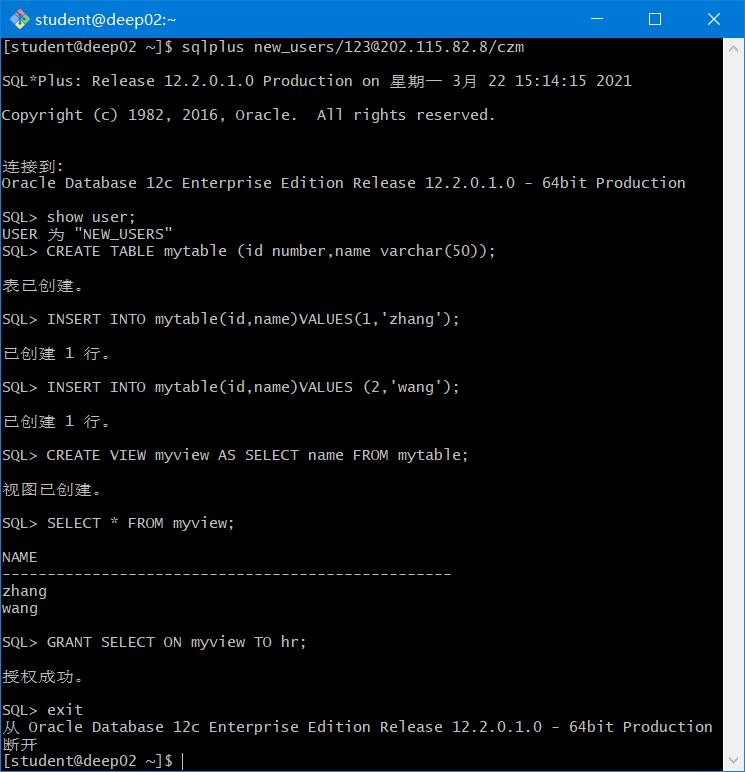
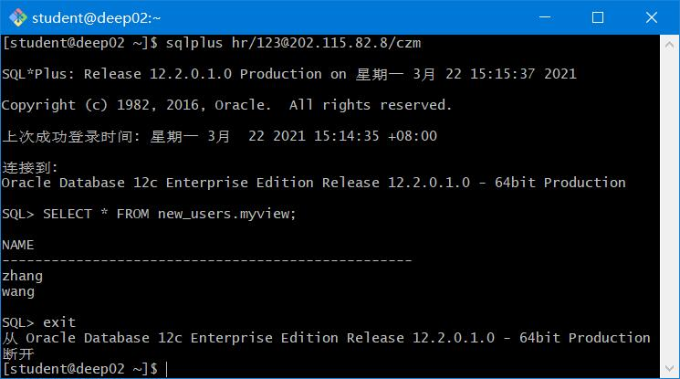
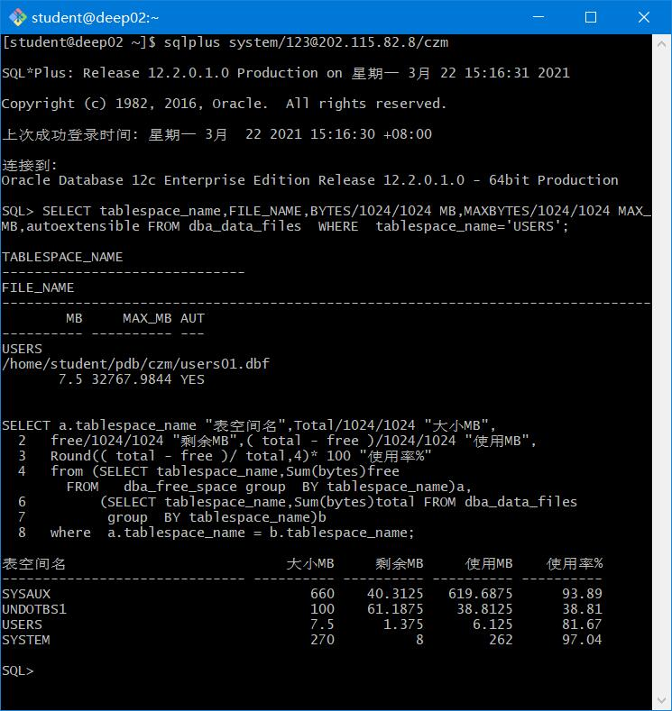

# oracle
## 实验二
##### 姓名：何政梁 
##### 学号：201810414112 
##### 班级：18软工一班

## 实验目的
掌握分区表的创建方法，掌握各种分区方式的使用场景。
## 实验内容
本实验使用3个表空间：USERS,USERS02,USERS03。在表空间中创建两张表：订单表(orders)与订
单详表(order_details)。
使用你自己的账号创建本实验的表，表创建在上述3个分区，自定义分区策略。
你需要使用system用户给你自己的账号分配上述分区的使用权限。你需要使用system用户给你的用户
分配可以查询执行计划的权限。
表创建成功后，插入数据，数据能并平均分布到各个分区。每个表的数据都应该大于1万行，对表进行
联合查询。
写出插入数据的语句和查询数据的语句，并分析语句的执行计划。
进行分区与不分区的对比实验

####  实验步骤
* 第1步：使用system用户给自己的账号(yyt)分配上述分区的使用权限
```
[student@deep02 ~]$sqlplus system/123@localhost/pdborcl
SQL>ALTER USER your_user QUOTA UNLIMITED ON USERS;
SQL>ALTER USER your_user QUOTA UNLIMITED ON USERS02;
SQL>ALTER USER your_user QUOTA UNLIMITED ON USERS03;
SQL>exit
```

* 第2步：新用户new_users连接到pdborcl，创建表mytable和视图myview，插入数据，最后将myview的SELECT对象权限授予hr用户。
```
$ sqlplus new_users/123@202.115.82.8/czm
SQL> show user;
USER is "NEW_USER"
SQL> CREATE TABLE mytable (id number,name varchar(50));
Table created.
SQL> INSERT INTO mytable(id,name)VALUES(1,'zhang');
1 row created.
SQL> INSERT INTO mytable(id,name)VALUES (2,'wang');
1 row created.
SQL> CREATE VIEW myview AS SELECT name FROM mytable;
View created.
SQL> SELECT * FROM myview;
NAME
--------------------------------------------------
zhang
wang
SQL> GRANT SELECT ON myview TO hr;
Grant succeeded.
SQL>exit
```

* 第3步：用户hr连接到pdborcl，查询new_users授予它的视图myview
```
$ sqlplus hr/123@pdborcl
SQL> SELECT * FROM new_user.myview;
NAME
--------------------------------------------------
zhang
wang
SQL> exit
```

## 查看数据库的使用情况
```
$ sqlplus system/123@pdborcl

SQL>SELECT tablespace_name,FILE_NAME,BYTES/1024/1024 MB,MAXBYTES/1024/1024 MAX_MB,autoextensible FROM dba_data_files  WHERE  tablespace_name='USERS';

SQL>SELECT a.tablespace_name "表空间名",Total/1024/1024 "大小MB",
 free/1024/1024 "剩余MB",( total - free )/1024/1024 "使用MB",
 Round(( total - free )/ total,4)* 100 "使用率%"
 from (SELECT tablespace_name,Sum(bytes)free
        FROM   dba_free_space group  BY tablespace_name)a,
       (SELECT tablespace_name,Sum(bytes)total FROM dba_data_files
        group  BY tablespace_name)b
 where  a.tablespace_name = b.tablespace_name;
```
* autoextensible是显示表空间中的数据文件是否自动增加。
* MAX_MB是指数据文件的最大容量。

#### 数据库和表空间占用分析
  数据库pdborcl中包含了con_ress_view角色和new_users用户。 使用表空间users存储表的数据。 表空间中存储了很多相同名称的表mytable和视图myview，但分别属性于不同的用户，不会引起混淆。 随着用户往表中插入数据，表空间的磁盘使用量会增加。