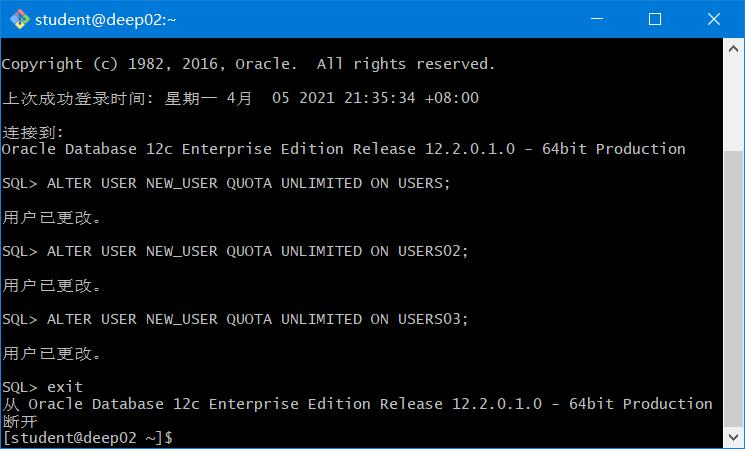
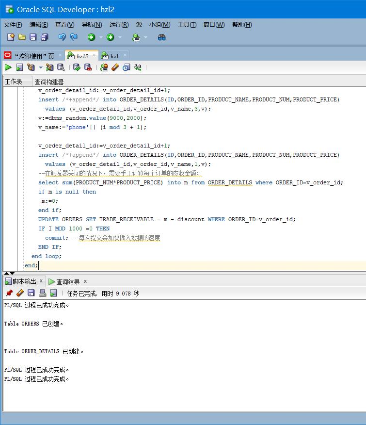
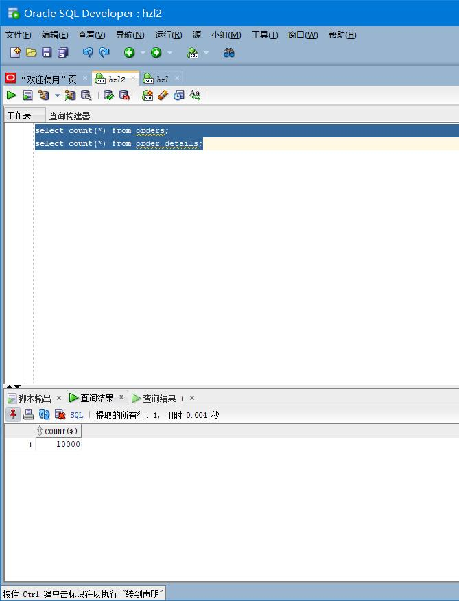
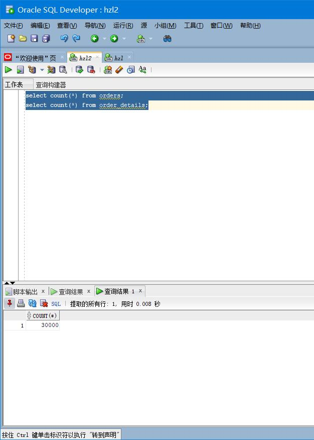
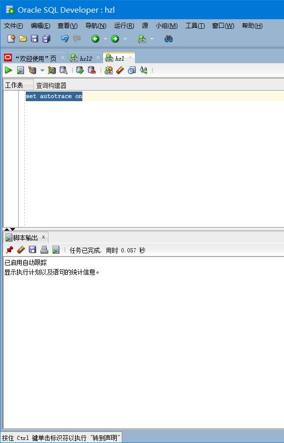
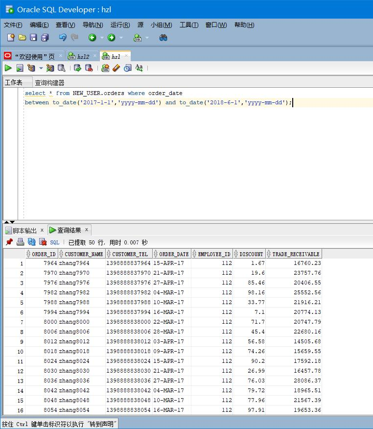
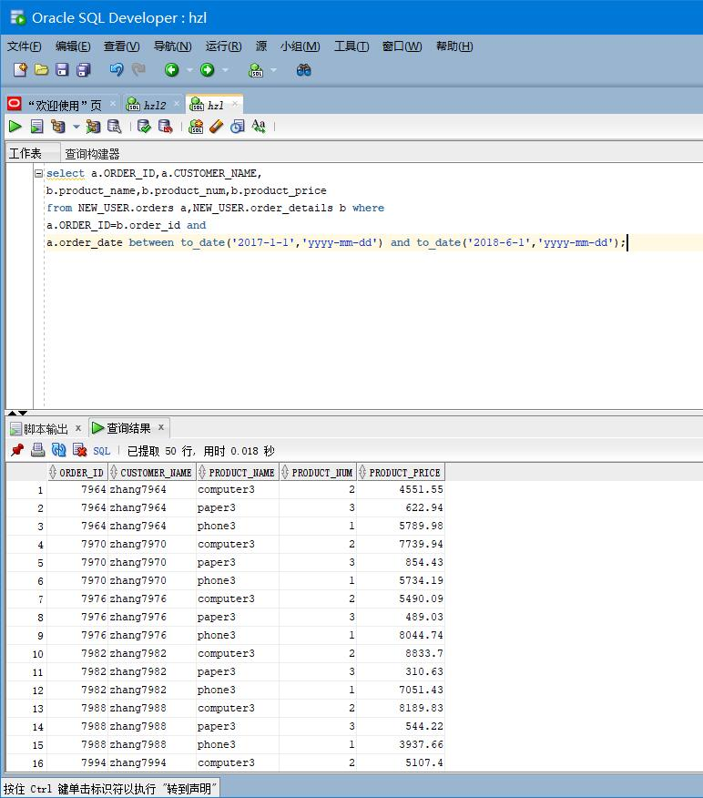
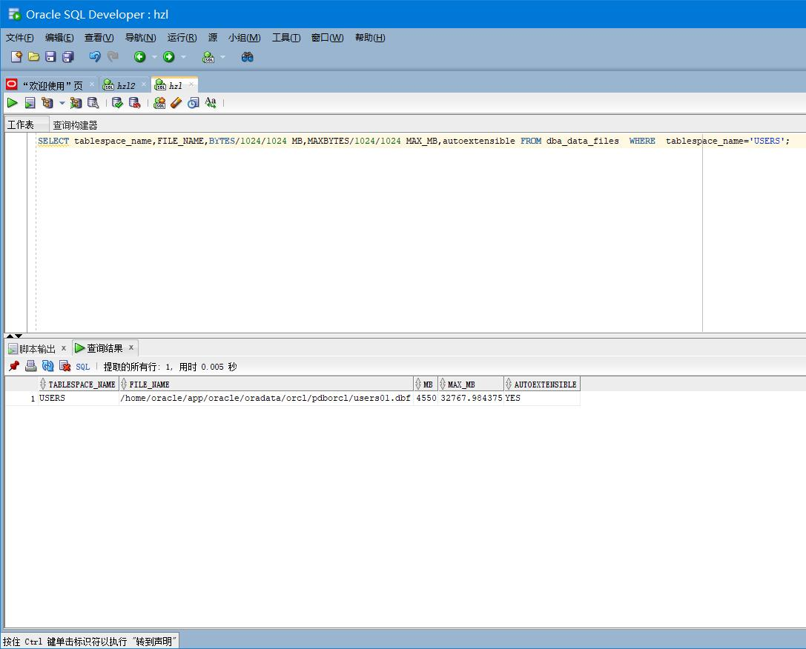
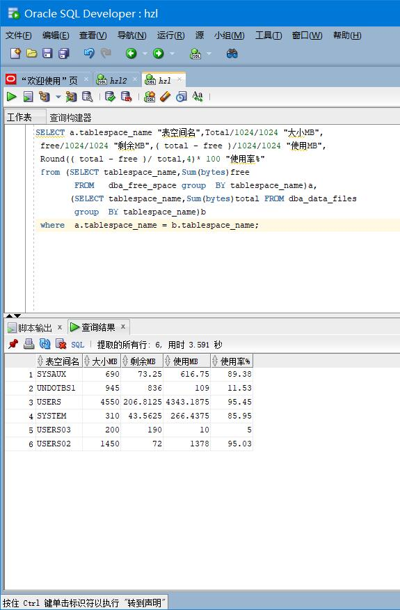

# oracle
## 实验三
##### 姓名：何政梁 
##### 学号：201810414112 
##### 班级：18软工一班

## 实验目的
掌握用户管理、角色管理、权根维护与分配的能力，掌握用户之间共享对象的操作技能。
## 实验内容
Oracle有一个开发者角色resource，可以创建表、过程、触发器等对象，但是不能创建视图。本训练要求：

* 在pdborcl插接式数据中创建一个新的本地角色con_res_view，该角色包含connect和resource角色，同时也包含CREATE VIEW权限，这样任何拥有con_res_view的用户就同时拥有这三种权限。
* 创建角色之后，再创建用户new_user，给用户分配表空间，设置限额为50M，授予con_res_view角色。
* 最后测试：用新用户new_user连接数据库、创建表，插入数据，创建视图，查询表和视图的数据。

####  实验步骤
* 第1步：以system登录到pdborcl，创建角色con_ress_view和用户new_users，并授权和分配空间：
* 本实验用户名:new_users
```
$ sqlplus system/123@202.115.82.8/czm
SQL> CREATE ROLE con_ress_view;
Role created.
SQL> GRANT connect,resource,CREATE VIEW TO con_ress_view;
Grant succeeded.
SQL> CREATE USER new_users IDENTIFIED BY 123 DEFAULT TABLESPACE users TEMPORARY TABLESPACE temp;
User created.
SQL> ALTER USER new_users QUOTA 50M ON users;
User altered.
SQL> GRANT con_ress_view TO new_users;
Grant succeeded.
SQL> exit
```

* 第2步：以自己的账号NEW_USER身份登录,并运行SQL文件创建表,并且插入数据:
```
declare
      num   number;
begin
      select count(1) into num from user_tables where TABLE_NAME = 'ORDER_DETAILS';
      if   num=1   then
          execute immediate 'drop table ORDER_DETAILS cascade constraints PURGE';
      end   if;

      select count(1) into num from user_tables where TABLE_NAME = 'ORDERS';
      if   num=1   then
          execute immediate 'drop table ORDERS cascade constraints PURGE';
      end   if;
end;
/

CREATE TABLE ORDERS
(
  ORDER_ID NUMBER(10, 0) NOT NULL
, CUSTOMER_NAME VARCHAR2(40 BYTE) NOT NULL
, CUSTOMER_TEL VARCHAR2(40 BYTE) NOT NULL
, ORDER_DATE DATE NOT NULL
, EMPLOYEE_ID NUMBER(6, 0) NOT NULL
, DISCOUNT NUMBER(8, 2) DEFAULT 0
, TRADE_RECEIVABLE NUMBER(8, 2) DEFAULT 0
, CONSTRAINT ORDERS_PK PRIMARY KEY
  (
    ORDER_ID
  )
  USING INDEX
  (
      CREATE UNIQUE INDEX ORDERS_PK ON ORDERS (ORDER_ID ASC)
      LOGGING
      TABLESPACE USERS
      PCTFREE 10
      INITRANS 2
      STORAGE
      (
        BUFFER_POOL DEFAULT
      )
      NOPARALLEL
  )
  ENABLE
)
TABLESPACE USERS
PCTFREE 10
INITRANS 1
STORAGE
(
  BUFFER_POOL DEFAULT
)
NOCOMPRESS
NOPARALLEL
PARTITION BY RANGE (ORDER_DATE)
(
  PARTITION PARTITION_2015 VALUES LESS THAN (TO_DATE(' 2016-01-01 00:00:00', 'SYYYY-MM-DD HH24:MI:SS', 'NLS_CALENDAR=GREGORIAN'))
  NOLOGGING
  TABLESPACE USERS
  PCTFREE 10
  INITRANS 1
  STORAGE
  (
    INITIAL 8388608
    NEXT 1048576
    MINEXTENTS 1
    MAXEXTENTS UNLIMITED
    BUFFER_POOL DEFAULT
  )
  NOCOMPRESS NO INMEMORY
, PARTITION PARTITION_2016 VALUES LESS THAN (TO_DATE(' 2017-01-01 00:00:00', 'SYYYY-MM-DD HH24:MI:SS', 'NLS_CALENDAR=GREGORIAN'))
  NOLOGGING
  TABLESPACE USERS
  PCTFREE 10
  INITRANS 1
  STORAGE
  (
    BUFFER_POOL DEFAULT
  )
  NOCOMPRESS NO INMEMORY
, PARTITION PARTITION_2017 VALUES LESS THAN (TO_DATE(' 2018-01-01 00:00:00', 'SYYYY-MM-DD HH24:MI:SS', 'NLS_CALENDAR=GREGORIAN'))
  NOLOGGING
  TABLESPACE USERS
  PCTFREE 10
  INITRANS 1
  STORAGE
  (
    BUFFER_POOL DEFAULT
  )
  NOCOMPRESS NO INMEMORY
, PARTITION PARTITION_2018 VALUES LESS THAN (TO_DATE(' 2019-01-01 00:00:00', 'SYYYY-MM-DD HH24:MI:SS', 'NLS_CALENDAR=GREGORIAN'))
  NOLOGGING
  TABLESPACE USERS02
  PCTFREE 10
  INITRANS 1
  STORAGE
  (
    BUFFER_POOL DEFAULT
  )
  NOCOMPRESS NO INMEMORY
, PARTITION PARTITION_2019 VALUES LESS THAN (TO_DATE(' 2020-01-01 00:00:00', 'SYYYY-MM-DD HH24:MI:SS', 'NLS_CALENDAR=GREGORIAN'))
  NOLOGGING
  TABLESPACE USERS02
  PCTFREE 10
  INITRANS 1
  STORAGE
  (
    BUFFER_POOL DEFAULT
  )
  NOCOMPRESS NO INMEMORY
, PARTITION PARTITION_2020 VALUES LESS THAN (TO_DATE(' 2021-01-01 00:00:00', 'SYYYY-MM-DD HH24:MI:SS', 'NLS_CALENDAR=GREGORIAN'))
  NOLOGGING
  TABLESPACE USERS02
  PCTFREE 10
  INITRANS 1
  STORAGE
  (
    BUFFER_POOL DEFAULT
  )
  NOCOMPRESS NO INMEMORY
, PARTITION PARTITION_2021 VALUES LESS THAN (TO_DATE(' 2022-01-01 00:00:00', 'SYYYY-MM-DD HH24:MI:SS', 'NLS_CALENDAR=GREGORIAN'))
  NOLOGGING
  TABLESPACE USERS03
  PCTFREE 10
  INITRANS 1
  STORAGE
  (
    BUFFER_POOL DEFAULT
  )
  NOCOMPRESS NO INMEMORY
);

CREATE TABLE order_details
(
id NUMBER(10, 0) NOT NULL
, order_id NUMBER(10, 0) NOT NULL
, product_name VARCHAR2(40 BYTE) NOT NULL
, product_num NUMBER(8, 2) NOT NULL
, product_price NUMBER(8, 2) NOT NULL
, CONSTRAINT order_details_fk1 FOREIGN KEY  (order_id)
REFERENCES orders  (  order_id   )
ENABLE
)
TABLESPACE USERS
PCTFREE 10 INITRANS 1
STORAGE (BUFFER_POOL DEFAULT )
NOCOMPRESS NOPARALLEL
PARTITION BY REFERENCE (order_details_fk1);

```
##### 插入数据
```
declare
  dt date;
  m number(8,2);
  V_EMPLOYEE_ID NUMBER(6);
  v_order_id number(10);
  v_name varchar2(100);
  v_tel varchar2(100);
  v number(10,2);
  v_order_detail_id number;
begin
/*
system login:
ALTER USER "TEACHER" QUOTA UNLIMITED ON USERS;
ALTER USER "TEACHER" QUOTA UNLIMITED ON USERS02;
ALTER USER "TEACHER" QUOTA UNLIMITED ON USERS03;
*/
  v_order_detail_id:=1;
  delete from order_details;
  delete from orders;
  for i in 1..10000
  loop
    if i mod 6 =0 then
      dt:=to_date('2015-3-2','yyyy-mm-dd')+(i mod 60); --PARTITION_2015
    elsif i mod 6 =1 then
      dt:=to_date('2016-3-2','yyyy-mm-dd')+(i mod 60); --PARTITION_2016
    elsif i mod 6 =2 then
      dt:=to_date('2017-3-2','yyyy-mm-dd')+(i mod 60); --PARTITION_2017
    elsif i mod 6 =3 then
      dt:=to_date('2018-3-2','yyyy-mm-dd')+(i mod 60); --PARTITION_2018
    elsif i mod 6 =4 then
      dt:=to_date('2019-3-2','yyyy-mm-dd')+(i mod 60); --PARTITION_2019
    else
      dt:=to_date('2020-3-2','yyyy-mm-dd')+(i mod 60); --PARTITION_2020
    end if;
    V_EMPLOYEE_ID:=CASE I MOD 6 WHEN 0 THEN 11 WHEN 1 THEN 111 WHEN 2 THEN 112
                                WHEN 3 THEN 12 WHEN 4 THEN 121 ELSE 122 END;
    --插入订单
    v_order_id:=i;
    v_name := 'aa'|| 'aa';
    v_name := 'zhang' || i;
    v_tel := '139888883' || i;
    insert /*+append*/ into ORDERS (ORDER_ID,CUSTOMER_NAME,CUSTOMER_TEL,ORDER_DATE,EMPLOYEE_ID,DISCOUNT)
      values (v_order_id,v_name,v_tel,dt,V_EMPLOYEE_ID,dbms_random.value(100,0));
    --插入订单y一个订单包括3个产品
    v:=dbms_random.value(10000,4000);
    v_name:='computer'|| (i mod 3 + 1);
    insert /*+append*/ into ORDER_DETAILS(ID,ORDER_ID,PRODUCT_NAME,PRODUCT_NUM,PRODUCT_PRICE)
      values (v_order_detail_id,v_order_id,v_name,2,v);
    v:=dbms_random.value(1000,50);
    v_name:='paper'|| (i mod 3 + 1);
    v_order_detail_id:=v_order_detail_id+1;
    insert /*+append*/ into ORDER_DETAILS(ID,ORDER_ID,PRODUCT_NAME,PRODUCT_NUM,PRODUCT_PRICE)
      values (v_order_detail_id,v_order_id,v_name,3,v);
    v:=dbms_random.value(9000,2000);
    v_name:='phone'|| (i mod 3 + 1);

    v_order_detail_id:=v_order_detail_id+1;
    insert /*+append*/ into ORDER_DETAILS(ID,ORDER_ID,PRODUCT_NAME,PRODUCT_NUM,PRODUCT_PRICE)
      values (v_order_detail_id,v_order_id,v_name,1,v);
    --在触发器关闭的情况下，需要手工计算每个订单的应收金额：
    select sum(PRODUCT_NUM*PRODUCT_PRICE) into m from ORDER_DETAILS where ORDER_ID=v_order_id;
    if m is null then
     m:=0;
    end if;
    UPDATE ORDERS SET TRADE_RECEIVABLE = m - discount WHERE ORDER_ID=v_order_id;
    IF I MOD 1000 =0 THEN
      commit; --每次提交会加快插入数据的速度
    END IF;
  end loop;
end;
```

* 第3步：查询数据条数
```
select count(*) from orders;
select count(*) from order_details;
```


* 第4步：以system用户运行
```
set autotrace on

select * from NEW_USER.orders where order_date
between to_date('2017-1-1','yyyy-mm-dd') and to_date('2018-6-1','yyyy-mm-dd');

select a.ORDER_ID,a.CUSTOMER_NAME,
b.product_name,b.product_num,b.product_price
from NEW_USER.orders a,NEW_USER.order_details b where
a.ORDER_ID=b.order_id and
a.order_date between to_date('2017-1-1','yyyy-mm-dd') and to_date('2018-6-1','yyyy-mm-dd');
```




## 查看数据库的使用情况
```
SQL>SELECT tablespace_name,FILE_NAME,BYTES/1024/1024 MB,MAXBYTES/1024/1024 MAX_MB,autoextensible FROM dba_data_files  WHERE  tablespace_name='USERS';

SQL>SELECT a.tablespace_name "表空间名",Total/1024/1024 "大小MB",
 free/1024/1024 "剩余MB",( total - free )/1024/1024 "使用MB",
 Round(( total - free )/ total,4)* 100 "使用率%"
 from (SELECT tablespace_name,Sum(bytes)free
        FROM   dba_free_space group  BY tablespace_name)a,
       (SELECT tablespace_name,Sum(bytes)total FROM dba_data_files
        group  BY tablespace_name)b
 where  a.tablespace_name = b.tablespace_name;
```
* autoextensible是显示表空间中的数据文件是否自动增加。
* MAX_MB是指数据文件的最大容量。


#### Oracle 分区表 总结
* Oracle提供了分区技术以支持VLDB(Very Large DataBase)。分区表通过对分区列的判断，把分区列不同的记录，放到不同的分区中。分区完全对应用透明。
* Oracle的分区表可以包括多个分区，每个分区都是一个独立的段（SEGMENT），可以存放到不同的表空间中。查询时可以通过查询表来访问各个分区中的数据，也可以通过在查询时直接指定分区的方法来进行查询。